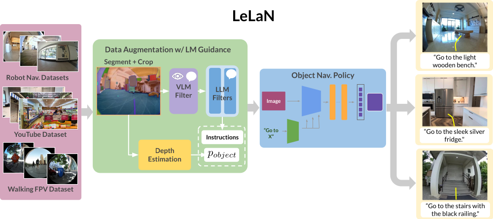

# LeLaN: Learning A Language-conditioned Navigation Policy from In-the-Wild Video
LeLaN：从公开视频中学习语言条件导航策略

[](https://arxiv.org/pdf/2407.08693)
[](https://www.python.org)
[](https://opensource.org/licenses/MIT)
[](https://learning-language-navigation.github.io)


[Noriaki Hirose](https://sites.google.com/view/noriaki-hirose/)<sup>1, 2</sup>, [Catherine Glossop](https://www.linkedin.com/in/catherineglossop/)<sup>1</sup>\*, [Ajay Sridhar](https://ajaysridhar.com/)<sup>1</sup>\*, [Oier Mees](https://www.oiermees.com/)<sup>1</sup>, [Sergey Levine](https://people.eecs.berkeley.edu/~svlevine/)<sup>1</sup>
作者：[Noriaki Hirose](https://sites.google.com/view/noriaki-hirose/)<sup>1, 2</sup>、[Catherine Glossop](https://www.linkedin.com/in/catherineglossop/)<sup>1</sup>\*、[Ajay Sridhar](https://ajaysridhar.com/)<sup>1</sup>\*、[Oier Mees](https://www.oiermees.com/)<sup>1</sup>、[Sergey Levine](https://people.eecs.berkeley.edu/~svlevine/)<sup>1</sup>

<sup>1</sup> UC Berkeley (_Berkeley AI Research_),  <sup>2</sup> Toyota Motor North America, \* indicates equal contributiion
<sup>1</sup> 加州大学伯克利分校（伯克利人工智能研究院），<sup>2</sup> 丰田北美，\* 表示共同一作

We present LeLaN, a novel method leverages foundation models to label in-the-wild video data with
language instructions for object navigation. We train an object navigation policy on this data, result-
ing in state-of-the-art performance on challenging zero-shot language-conditioned object navigation
task across a wide variety of indoor and outdoor environments.
我们提出了 LeLaN，这是一种新方法，利用基础模型为真实世界视频数据自动标注用于目标导航的语言指令。我们基于这些数据训练了一个目标导航策略，使其在多种室内外环境中的高难度零样本语言条件目标导航任务上取得了当前最先进的性能。





### Installation
安装

Please down load our code and install some tools for making a conda environment to run our code. We recommend to run our code in the conda environment, although we do not mention the conda environments later.
请先下载代码，并安装用于创建 conda 环境的相关工具来运行本项目。我们推荐在 conda 环境中运行代码，尽管后文不再反复强调这一点。

1. Download the repository on your PC:
   在你的电脑上下载本仓库：
    ```
    git clone https://github.com/NHirose/learning-language-navigation.git
    ```
2. Set up the conda environment:
   创建 conda 环境：
    ```
    conda env create -f train/train_lelan.yml
    ```
3. Source the conda environment:
   激活 conda 环境：
    ```
    conda activate lelan
    ```
4. Install the lelan packages:
   安装 lelan 相关包：
    ```
    pip install -e train/
    ```
5. Install the `diffusion_policy` package from this [repo](https://github.com/real-stanford/diffusion_policy):
   从这个 [仓库](https://github.com/real-stanford/diffusion_policy) 安装 `diffusion_policy` 包：
    ```
    git clone git@github.com:real-stanford/diffusion_policy.git
    pip install -e diffusion_policy/
    ```

### Data
数据

We train our model with the following datasets. We annotate the publicly available robot navigation dataset as well as the in-the-wild videos such as YouTube. In addition, we collected the videos by holding the shperical camera and walking around outside and annotated them by our method. We publish all annotated labels and corresponding images [here](https://drive.google.com/file/d/1IazHcIyPGO7ENswz8_sGCIGBXF8_sZJK/view?usp=sharing). Note that we provide the python code to download and save the images from the YouTube videos instead of providing the images, due to avoiding the copyright issue.
我们使用以下数据集来训练模型。我们对公开可用的机器人导航数据集以及 YouTube 等真实世界视频进行了标注。此外，我们还手持全景相机在室外行走采集视频，并使用我们的方法进行标注。所有标注结果及其对应图像都发布在[这里](https://drive.google.com/file/d/1IazHcIyPGO7ENswz8_sGCIGBXF8_sZJK/view?usp=sharing)。需要注意的是，出于版权原因，我们提供的是用于下载并保存 YouTube 视频图像的 Python 代码，而不是直接提供这些图像本身。

- Robot navigation dataset (GO Stanford2, GO Stanford4, and SACSoN)
  机器人导航数据集（GO Stanford2、GO Stanford4 和 SACSoN）
- Human-walking dataset
  人类步行数据集
- YouTube tour dataset
  YouTube 场景漫游数据集

Followings are the process to use our dataset on our training code.
下面是将我们的数据集用于训练代码的流程。

1. Download the dataset from [here](https://drive.google.com/file/d/1IazHcIyPGO7ENswz8_sGCIGBXF8_sZJK/view?usp=sharing) and unzip the file in the downloaded repository:
   从[这里](https://drive.google.com/file/d/1IazHcIyPGO7ENswz8_sGCIGBXF8_sZJK/view?usp=sharing)下载数据集，并将压缩包解压到已下载的仓库目录中：

2. Change the directory:
   进入对应目录：
    ```
    cd learning-language-navigation/download_youtube
    ```
3. Download the YouTube videos and save the corresponding images:
   下载 YouTube 视频并保存对应图像：
    ```
    python save_youtube_image.py
    ```

## Train
训练

The subfolder `learning-language-navigation/train/` contains code for training models from your own data. The codebase assumes access to a workstation running Ubuntu (tested on 18.04 and 20.04), Python 3.7+, and a GPU with CUDA 10+. It also assumes access to conda, but you can modify it to work with other virtual environment packages, or a native setup.
子目录 `learning-language-navigation/train/` 包含了使用你自己的数据训练模型所需的代码。该代码库默认你使用的是 Ubuntu 工作站（已在 18.04 和 20.04 上测试）、Python 3.7 及以上版本，以及支持 CUDA 10 及以上的 GPU。同时也默认你可以使用 conda，不过你也可以将其修改为适配其他虚拟环境工具，或者直接在原生环境中运行。

### Training LeLaN
训练 LeLaN

#### without collision avoidance
不带避障约束

Run this inside the `learning-language-navigation/train` directory:
在 `learning-language-navigation/train` 目录下运行：
```
python train.py -c ./config/lelan.yaml
```

#### with collision avoidance using the NoMaD supervisions
使用 NoMaD 监督加入避障约束

Before training, please download the checkpoint of the finetuned nomad checkpoints for the cropped goal images from [here](https://drive.google.com/drive/folders/19yJcSJvGmpGlo0X-0owQKrrkPFmPKVt8?usp=sharing) and save `nomad_crop.pth` at `learning-language-navigation/train/logs/nomad/nomad_crop/`. For collision avoindace, we pre-train the policy without the collision avoidance loss. After that we can finetune it with the collision avoidance loss using the NoMaD supervisions.
在训练之前，请先从[这里](https://drive.google.com/drive/folders/19yJcSJvGmpGlo0X-0owQKrrkPFmPKVt8?usp=sharing)下载针对裁剪目标图像微调后的 NoMaD checkpoint，并将 `nomad_crop.pth` 保存在 `learning-language-navigation/train/logs/nomad/nomad_crop/` 中。对于避障版本，我们会先训练一个不带碰撞规避损失的策略模型，然后再利用 NoMaD 提供的监督加入碰撞规避损失进行微调。

Run this inside the `learning-language-navigation/train` directory for pretraining:
在 `learning-language-navigation/train` 目录下运行以下命令进行预训练：
```
python train.py -c ./config/lelan_col_pretrain.yaml
```
Then, run this for finetuning (Note that you need to edit the folder name to specify the location of the pretrained model in lelan_col.yaml):
然后运行以下命令进行微调（注意你需要修改 `lelan_col.yaml` 中的文件夹名称，以指定预训练模型的位置）：
```
python train.py -c ./config/lelan_col.yaml
```

##### Custom Config Files
自定义配置文件

`config/lelan.yaml` and `config/lelan_col.yaml` is the premade yaml files for the LeLaN.
`config/lelan.yaml` 和 `config/lelan_col.yaml` 是为 LeLaN 预先准备好的 yaml 配置文件。


##### Training your model from a checkpoint
从 checkpoint 继续训练你的模型

Please carefully check the original [code](https://github.com/robodhruv/visualnav-transformer) to know how to train your model from a checkpoint.
如果你想从 checkpoint 继续训练自己的模型，请仔细查看原始[代码](https://github.com/robodhruv/visualnav-transformer)，了解具体做法。


## Deployment
部署

The subfolder `learning-language-navigation/deployment/` contains code to load a pre-trained LeLaN and deploy it on your robot platform with a [NVIDIA Jetson Orin](https://www.nvidia.com/en-us/autonomous-machines/embedded-systems/jetson-orin/)(We test our policy on Nvidia Jetson Orin AGX).
子目录 `learning-language-navigation/deployment/` 包含了加载预训练 LeLaN 并将其部署到你的机器人平台上的代码，部署平台为 [NVIDIA Jetson Orin](https://www.nvidia.com/en-us/autonomous-machines/embedded-systems/jetson-orin/)（我们的策略是在 Nvidia Jetson Orin AGX 上测试的）。

### Hardware Setup
硬件配置

We need following three hardwares to navigate the robot toward the target object location with the LeLaN.
为了使用 LeLaN 让机器人导航到目标物体所在位置，我们需要以下三类硬件。

1. Robot: Please setup the ROS on your robot to enable us to control the robot by "/cmd_vel" of geometry_msgs/Twist message. We tested on the Vizbot(Roomba base robot) and the quadruped robot Go1.
   机器人：请在你的机器人上配置好 ROS，使我们能够通过 `geometry_msgs/Twist` 类型的 `/cmd_vel` 话题来控制机器人。我们在 Vizbot（基于 Roomba 的机器人）和四足机器人 Go1 上做过测试。

2. Camera: Please mount the camera on your robot, which we can use on ROS to publish `sensor_msgs/Image`. We tested the [ELP fisheye camera](https://www.amazon.com/ELP-170degree-Fisheye-640x480-Resolution/dp/B00VTHD17W), the [Ricoh Theta S](https://us.ricoh-imaging.com/product/theta-s/), and the [Intel D435i](https://www.intelrealsense.com/depth-camera-d435i/).
   相机：请在机器人上安装相机，并在 ROS 中发布 `sensor_msgs/Image` 图像话题。我们测试过 [ELP 鱼眼相机](https://www.amazon.com/ELP-170degree-Fisheye-640x480-Resolution/dp/B00VTHD17W)、[Ricoh Theta S](https://us.ricoh-imaging.com/product/theta-s/) 和 [Intel D435i](https://www.intelrealsense.com/depth-camera-d435i/)。

3. Joystick: [Joystick](https://www.amazon.com/Logitech-Wireless-Nano-Receiver-Controller-Vibration/dp/B0041RR0TW)/[keyboard teleop](http://wiki.ros.org/teleop_twist_keyboard) that works with Linux. Add the index mapping for the _deadman_switch_ on the joystick to the `learning-language-navigation/deployment/config/joystick.yaml`. You can find the mapping from buttons to indices for common joysticks in the [wiki](https://wiki.ros.org/joy).
   手柄：需要一个可在 Linux 上工作的[手柄](https://www.amazon.com/Logitech-Wireless-Nano-Receiver-Controller-Vibration/dp/B0041RR0TW)或[keyboard teleop](http://wiki.ros.org/teleop_twist_keyboard)。请将手柄上的 `_deadman_switch_` 按键索引映射添加到 `learning-language-navigation/deployment/config/joystick.yaml` 中。常见手柄的按键与索引映射可以在 [wiki](https://wiki.ros.org/joy) 中找到。


### Software Setup
软件配置

#### Loading the model weights
加载模型权重

Save the model weights *.pth file in `learning-language-navigation/deployment/model_weights` folder. Our model's weights are in [this link](https://drive.google.com/drive/folders/19yJcSJvGmpGlo0X-0owQKrrkPFmPKVt8?usp=sharing). In addition, if you want to control the robot toward the far target object, which is not seen from the initial robot location, please download the original ViNT's weights in [this link](https://drive.google.com/drive/folders/1a9yWR2iooXFAqjQHetz263--4_2FFggg) to navigate the robot with the topological memory.
请将模型权重 `*.pth` 文件保存到 `learning-language-navigation/deployment/model_weights` 文件夹中。我们的模型权重在[这个链接](https://drive.google.com/drive/folders/19yJcSJvGmpGlo0X-0owQKrrkPFmPKVt8?usp=sharing)中。另外，如果你想让机器人导航到初始位置看不到的远距离目标，请从[这个链接](https://drive.google.com/drive/folders/1a9yWR2iooXFAqjQHetz263--4_2FFggg)下载原始 ViNT 的权重，以便结合拓扑记忆进行导航。

#### Last-mile Navigation
最后一段近距离导航

If the target object location is close to the robot and visible from the robot, you can simply run the LeLaN to move toward the target object.
如果目标物体距离机器人较近，并且一开始就在机器人视野内，那么你可以直接运行 LeLaN，让机器人朝目标物体移动。

1. `roscore`
   启动 `roscore`
2. Launch camera node: Please start the camera node to publish the topic, `sensor_msgs/Image`. For example, we use the [usb_cam](http://wiki.ros.org/usb_cam) for the [ELP fisheye camera](https://www.amazon.com/ELP-170degree-Fisheye-640x480-Resolution/dp/B00VTHD17W), the [cv_camera](http://wiki.ros.org/cv_camera) for the [spherical camera](https://us.ricoh-imaging.com/product/theta-s/) and the [realsense2_camera](http://wiki.ros.org/realsense2_camera) for the [Intel D435i](https://www.intelrealsense.com/depth-camera-d435i/). We recommned to use a wide-angle RGB camera to robustly capture the target objects.
   启动相机节点：请启动相机节点以发布 `sensor_msgs/Image` 类型的话题。例如，我们对 [ELP 鱼眼相机](https://www.amazon.com/ELP-170degree-Fisheye-640x480-Resolution/dp/B00VTHD17W) 使用 [usb_cam](http://wiki.ros.org/usb_cam)，对[全景相机](https://us.ricoh-imaging.com/product/theta-s/)使用 [cv_camera](http://wiki.ros.org/cv_camera)，对 [Intel D435i](https://www.intelrealsense.com/depth-camera-d435i/) 使用 [realsense2_camera](http://wiki.ros.org/realsense2_camera)。我们推荐使用广角 RGB 相机，以更稳健地捕捉目标物体。
3. Launch LeLaN policy: This command immediately run the robot toward the target objects, which correspond to the `<prompt for target object>` such as "office chair". The example of `<path for the config file>` is `'../../train/config/lelan.yaml'`, which you can specify the same yaml file in your training. `<path for the moel checkpoint>` is the path for your trained model. The default is `'../model_weights/wo_col_loss_wo_temp.pth'`. `<bool for camera type>` is the boolean to specify whether the camera is the Ricoh Theta S or not.
   启动 LeLaN 策略：下面这条命令会让机器人立即朝目标物体移动，其中 `<prompt for target object>` 对应目标物体的文本提示，例如 `"office chair"`。`<path for the config file>` 的示例是 `'../../train/config/lelan.yaml'`，你可以指定训练时用到的同一份 yaml。`<path for the moel checkpoint>` 是训练好的模型路径，默认值是 `'../model_weights/wo_col_loss_wo_temp.pth'`。`<bool for camera type>` 用于指定相机是否为 Ricoh Theta S。
```
python lelan_policy_col.py -p <prompt for target object> -c <path for the config file> -m <path for the moel checkpoint> -r <boolean for camera type>
```


Note that you manually change the topic name, 'TOPIC_NAME_CAMERA' in `lelan_policy_col.py`, before running the above command.
注意，在运行上述命令前，你需要手动修改 `lelan_policy_col.py` 中的相机话题名 `TOPIC_NAME_CAMERA`。

#### Long-distance Navigation
长距离导航

Since it is difficult for the LeLaN to navigate toward the far target object, we provide the system leveraging the topological map.
由于 LeLaN 直接导航到远距离目标物体较为困难，因此我们提供了一套结合拓扑地图的系统。

There are three steps in our approach, 0) search all node images and specify the target node capturing the tareget object, 1) move toward the target node, which is close to the target object, and 2) switch the policy to the LeLaN and go to the target object location. To search the target node in the topological memory in 0), we use Owl-ViT2 for scoring all nodes and select the node with the highest score. And, we use the ViNT policy for 1). Before navigation, we collect the topological map in your environment by teleperation. Then we can run our robot toward the far target object.
我们的方法分为三个步骤：0）检索所有节点图像，并确定拍到目标物体的目标节点；1）先移动到这个靠近目标物体的目标节点；2）再切换到 LeLaN 策略，前往目标物体的最终位置。在第 0 步中，我们使用 Owl-ViT2 对拓扑记忆中的所有节点打分，并选择分数最高的节点作为目标节点；在第 1 步中，我们使用 ViNT 策略进行导航。在正式导航前，我们会先通过遥操作在环境中采集拓扑地图。之后，机器人就可以朝远距离目标物体导航。

##### Collecting a Topological Map
采集拓扑地图

_Make sure to run these scripts inside the `learning-language-navigation/deployment/src/` directory._
_请确保在 `learning-language-navigation/deployment/src/` 目录中运行以下脚本。_

##### Record the rosbag:
录制 rosbag

Run this command to teleoperate the robot with the joystick and camera. This command opens up three windows
运行该命令后，可以结合手柄和相机对机器人进行遥操作。该命令会打开三个窗口。

1. Launch the robot driver: please launch the robot driver and setup the node, which eable us to run the robot via a topic of `geometry_msgs/Twist` for the velocity commands, `/cmd_vel`.
   启动机器人驱动：请启动机器人驱动并配置相应节点，使我们能够通过 `geometry_msgs/Twist` 类型的 `/cmd_vel` 速度命令话题控制机器人。
2. Launch the camera driver: please launch the `usb_cam` node for the camera.
   启动相机驱动：请为相机启动 `usb_cam` 节点。
3. Launch the joystic driver: please launch the joystic driver to publish `/cmd_vel`.
   启动手柄驱动：请启动手柄驱动，并发布 `/cmd_vel`。
4. `rosbag record /usb_cam/image_raw -o <bag_name>`: This command isn’t run immediately (you have to click Enter). It will be run in the learning-language-navigation/deployment/topomaps/bags directory, where we recommend you store your rosbags.
   `rosbag record /usb_cam/image_raw -o <bag_name>`：这条命令不会立刻执行（需要你按下回车）。它会在 `learning-language-navigation/deployment/topomaps/bags` 目录下运行，我们建议你将 rosbag 保存在这里。

Once you are ready to record the bag, run the `rosbag record` script and teleoperate the robot on the map you want the robot to follow. When you are finished with recording the path, kill the `rosbag record` command, and then kill all sessions.
准备好开始录包后，运行 `rosbag record` 脚本，并遥操作机器人沿着你希望其后续跟随的路线行走。录制结束后，先停止 `rosbag record` 命令，再关闭所有会话。

##### Make the topological map:
生成拓扑地图

Please open 3 windows and run followings one by one:
请打开 3 个窗口，并按顺序执行以下操作：
1. `roscore`
   启动 `roscore`
2. `python create_topomap.py —dt 1 —dir <topomap_dir>`: This command creates a directory in `/learning-language-navigation/deployment/topomaps/images` and saves an image as a node in the map every second the bag is played.
   `python create_topomap.py —dt 1 —dir <topomap_dir>`：该命令会在 `/learning-language-navigation/deployment/topomaps/images` 中创建一个目录，并在 bag 回放过程中每秒保存一张图像作为地图中的一个节点。
3. `rosbag play -r 1.5 <bag_filename>`: This command plays the rosbag at x1.5 speed, so the python script is actually recording nodes 1.5 seconds apart. The `<bag_filename>` should be the entire bag name with the .bag extension.
   `rosbag play -r 1.5 <bag_filename>`：该命令会以 1.5 倍速回放 rosbag，因此 Python 脚本实际上每隔 1.5 秒记录一个节点。`<bag_filename>` 需要填写带 `.bag` 后缀的完整文件名。

When the bag stops playing, kill all sessions.
当 bag 停止回放后，关闭所有会话。


#### Running the model
运行模型

Please open 4 windows:
请打开 4 个窗口：

1. launch the robot driver: please launch the robot driver and setup the node, which eable us to run the robot via a topic of `geometry_msgs/Twist` for the velocity commands, `/cmd_vel`.
   启动机器人驱动：请启动机器人驱动并配置相应节点，使我们能够通过 `geometry_msgs/Twist` 类型的 `/cmd_vel` 速度命令控制机器人。
2. launch the camera driver: please launch the `usb_cam` node for the camera.
   启动相机驱动：请为相机启动 `usb_cam` 节点。
3. `python pd_controller_lelan.py`: In the graph-based navigation phase, this python script starts a node that reads messages from the `/waypoint` topic (waypoints from the model) and outputs velocities by PD controller to navigate the robot’s base. In the final approach phase, this script selects the velocity commands from the LeLaN.
   `python pd_controller_lelan.py`：在基于图的导航阶段，该 Python 脚本会启动一个节点，从 `/waypoint` 话题读取模型输出的 waypoint，并通过 PD 控制器输出底盘速度。在最后靠近目标的阶段，该脚本会切换为使用 LeLaN 输出的速度命令。
4. `python navigate_lelan.py -p <prompt> --model vint -—dir <topomap_dir>`: In the graph-based navigation phase, this python script starts a node that reads in image observations from the `/usb_cam/image_raw` topic, inputs the observations and the map into the model, and publishes actions to the `/waypoint` topic. In the final approach phase, this script calculates the LeLaN policy and publishes the velocity commands to the `/vel_lelan` topic.
   `python navigate_lelan.py -p <prompt> --model vint -—dir <topomap_dir>`：在基于图的导航阶段，该 Python 脚本会启动一个节点，从 `/usb_cam/image_raw` 话题读取当前图像观测，将观测与地图一起输入模型，并把动作发布到 `/waypoint` 话题。在最后靠近目标的阶段，该脚本会计算 LeLaN 策略，并将速度命令发布到 `/vel_lelan` 话题。

The `<topomap_dir>` is the name of the directory in `learning-language-navigation/deployment/topomaps/images` that has the images corresponding to the nodes in the topological map. The images are ordered by name from 0 to N.
`<topomap_dir>` 是 `learning-language-navigation/deployment/topomaps/images` 下的目录名，其中保存了与拓扑地图各节点对应的图像。这些图像按文件名从 0 到 N 顺序排列。

When the robot is finishing navigating, kill the `pd_controller_lelan.py` script, and then kill all sessions. In the default setting, we run the simplest LeLaN policy not feeding the history of the image and not considering collision avoidance.
当机器人完成导航后，先停止 `pd_controller_lelan.py` 脚本，再关闭所有会话。默认设置下，我们运行的是最简单的 LeLaN 策略版本：不输入图像历史，也不考虑碰撞规避。

## Citing
引用

Our main project
我们的主项目论文
```
@inproceedings{hirose2024lelan,
  title     = {LeLaN: Learning A Language-conditioned Navigation Policy from In-the-Wild Video},
  author    = {Noriaki Hirose and Catherine Glossop and Ajay Sridhar and Oier Mees and Sergey Levine},
  booktitle = {8th Annual Conference on Robot Learning},
  year      = {2024},
  url       = {https://arxiv.org/abs/xxxxxxxx}
}
```
Robotic navigation dataset: GO Stanford 2
机器人导航数据集：GO Stanford 2
```
@inproceedings{hirose2018gonet,
  title={Gonet: A semi-supervised deep learning approach for traversability estimation},
  author={Hirose, Noriaki and Sadeghian, Amir and V{\'a}zquez, Marynel and Goebel, Patrick and Savarese, Silvio},
  booktitle={2018 IEEE/RSJ International Conference on Intelligent Robots and Systems (IROS)},
  pages={3044--3051},
  year={2018},
  organization={IEEE}
}
```
Robotic navigation dataset: GO Stanford 4
机器人导航数据集：GO Stanford 4
```
@article{hirose2019deep,
  title={Deep visual mpc-policy learning for navigation},
  author={Hirose, Noriaki and Xia, Fei and Mart{\'\i}n-Mart{\'\i}n, Roberto and Sadeghian, Amir and Savarese, Silvio},
  journal={IEEE Robotics and Automation Letters},
  volume={4},
  number={4},
  pages={3184--3191},
  year={2019},
  publisher={IEEE}
}
```
Robotic navigation dataset: SACSoN(HuRoN)
机器人导航数据集：SACSoN（HuRoN）
```
@article{hirose2023sacson,
  title={Sacson: Scalable autonomous control for social navigation},
  author={Hirose, Noriaki and Shah, Dhruv and Sridhar, Ajay and Levine, Sergey},
  journal={IEEE Robotics and Automation Letters},
  year={2023},
  publisher={IEEE}
}
```
